# Čo robí filmy obľúbenými/neobľúbenými
```
Projekt z predmetu Princípy dátovej vedy
Skupina: Lil Data
Členovia: Roderik Antol, Tomáš Belák, Adam Lopaška, František Václav Man
```

## Zdroj dát
Naše dáta pochádzajú z portálu IMDb - internetovej filmovej databázy. Stiahli sme si dáta vo formáte .tsv zo [stránky](https://datasets.imdbws.com/). Dáta boli príliš veľké na to, aby sme ich nahrali do pamäte a ďalej s nimi pracovali. Exportovali sme ich preto do sqlite3 databázy vo forme .db súboru aby sme v pamäti mali len to, na čo sme sa databázy dotazovali.

V práci používame primárne nami vytvorenú tabuľku `df_films`, ktorá vznikla spojením a dopočítaním viacerích tabuliek z našej databázy. V tabuľke máme nasledovné atribúty o filmoch: 
- priemerné hodnotenie, 
- počet hodnotení, 
- nami vypočítaná obľúbenosť (viac v nasledujúcej časti textu),
- počet prekladov filmu, 
- či je film pre dospelých, 
- rok výroby filmu, 
- dĺžka filmu v minútach, 
- žáner (jeden alebo viac) a 
- vek filmu - vypočítaný ako rok 2024 - rok výroby filmu.

Použité filtre na dáta:
- keďže chceme pracovať s filmami, odfiltrovali a vylúčili sme seriály, krátke filmy, videá a iné typy záznamov
- vybrali sme len hercov a režisérov a iba takích, ktorí pracovali na filmoch v našej tabuľke

Zároveň sme vyhľadali a pracovali aj s nasledujúcimi dátami
- 20 najlepších a 20 najhorších režisérov sme prebrali zo stránky ranker.com
- 20 najlepších hercov sme prevzali zo zoznamu od používateľa imdb.com s názvom <em>ChrisWalczyk55</em>
- Zoznam filmov, v ktorých aspoň jedna z hlavných postáv mala nejaké znevýhodnenie (fyzické či psychické), sme vygenerovali pomocou GPT-4

## Miera obľúbenosti
Ako reprezentovať obľúbenosť ? Ktoré atribúty môžu reprezentovať obľubenosť ? Hovorí nám rating filmu o tom, či je obľúbený ? Hovorí niečo o obľúbenosti filmu, koľko recenzíi dostal ?
Mnoho filmov nemá najlepšie hodnotenia no aj tak sú medzi ľuďmi obľúbené, často ide o Hollywoodske trháky, ktorých marketing vyvolá hype no finálny produkt má ďaleko od kinematografického skvostu. Tieto filmy, sú však diskutným predmetom, často spomínané, rozoberané a na filmových portáloch sa k nim vyjadruje veľa ľudí/kritikov - teda zrejme budú aj obľúbené. Chceli sme preto obľúbenosť reprezentovať metrikou, ktorá sa podobá aj nejakému nášmu podvedomému rozhodovaniu pri výberu reštaurácie, ktoré nepoznáme. Príklad: nachádzame sa v cudzine, na výber máme 2 reštaurácie, jedna má 4.5 hviezdičky na Googli avšak dostala len 10 recenzií. Druhá má síce už len 4.1 hviezdičky, ale obrdžala 700 recenzií. Zamysleli sme sa nad tým a všetci by sme radšej išli do reštaurácie číslo 2. Vybrali by sme si však reštauráciu č.2 aj keby mala len 3.6 hviezdičky ? No, vtedy by sme radšej riskli prvú reštauráciu. Tento proces výberu sme chceli zachovať aj v metrike pre filmy.

Pre definíciu miery obľúbenosti sme skúšali tri metriky. Prvou bolo log_score vypočítané ako priemerný rating filmu prenásobené logaritmom počtu hodnotení. 

Druhé skóre, ktoré sme skúšali, bolo normalizované skóre. Počítané ako priemerný rating krát počet hodnotení filmu vydelené maximálnym rating a maximálnym počtom hodnotení.

Ako tretie sme použili pragmatické skóre, počítané rovnako ako normalizované, iba namiesto maxím použijeme priemery. 

Z nasledujúcej tabuľky môžeme vidieť, že aj normalizované aj pragmatické skóre majú výraznejšie rozdiely medzi tretím a štrvtým kvartilom ako má log skóre. Log skóre bolo výhodnejšie aj z hľadiska matematických operácií a čitateľnosti, kde normalizované aj pragmatické skóre majú veľmi dlhé desatinné čísla. 

|       |   averageRating |         numVotes |    log_score |       norm_score |       prag_score |
|:------|----------------:|-----------------:|-------------:|-----------------:|-----------------:|
| count |    301868       | 301868           | 301868       | 301868           | 301868           |
| mean  |         6.17553 |   3627.84        |     28.0239  |      0.000898479 |      1.13691     |
| std   |         1.37358 |  35841           |     14.5419  |      0.0100013   |     12.6554      |
| min   |         1       |      5           |      1.79176 |      2.11646e-07 |      0.000267811 |
| 25%   |         5.3     |     19           |     17.8913  |      4.13768e-06 |      0.00523571  |
| 50%   |         6.3     |     61           |     24.6097  |      1.31432e-05 |      0.0166311   |
| 75%   |         7.1     |    315           |     34.1694  |      6.21367e-05 |      0.0786261   |
| max   |        10       |      2.83492e+06 |    138.175   |      0.93        |   1176.8         |

Log skóre sa nám javilo ako najlepšie reprezentujúce našu ideu o metrike a preto sme sa rozhodli nim reprezentovať obľúbenost filmu.
Ako aj z porovnania sumárnych štatistík, strednej hodnoty a mediánu, vidno, tak log skóre takto rozdelilo filmy na obľúbené a neobľúbené.


Naša miera obľúbenosti, log skóre, má jednu zásadnú nevýhodu. Vieme ukázať, že film s veľmi veľa negatívnymi hlasmi môže mať rovnaké, ak nie lepšie log skóre, ako film s málo perfektnými hodnoteniami. Napríklad film s priemerným hodnotením 10 a desiatimi hlasmi bude mať rovnaké skóre, ako film s priemerným skóre 1 a počtom hlasov `10^10`. Toto vnímame ako veľkú slabinu a uvedomili sme si to až pri písaní reportu. Znamenalo by to, že film, ktorý je globálne nenávidený by sme my cez log skóre vnímali, ako celkom obľúbený. 

**TODO pohladat zaznamy, kde toto nastava a popisat, co s tym**

## Exploratívna dátová analýza
### Základné vlastnosti našich dát:

**TODO Rozdelenie log skóre**

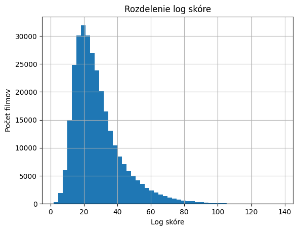

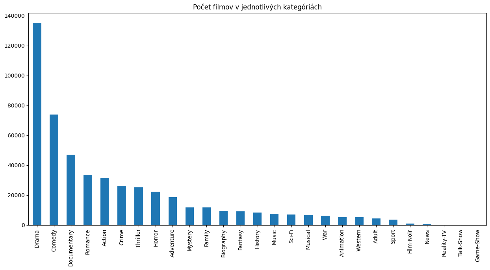

Ako prvé sme pozreli, či a ako vplýva žáner filmu na jeho obľúbenosť. Z nasledujúcich grafov vidno, že skóre, resp. obľúbenosť, nemá významnú závislosť od žánru a skupín žánrov. Stredná hodnota korelácie je 4.3%, s tretím kvartilom na 6.8% percentách, čo je pod hranicou významnosti. Dva žánre, ktoré mali koreláciu nad 10%: Drama a Crime.

**TODO: Doplniť popis a vysvetlenia**

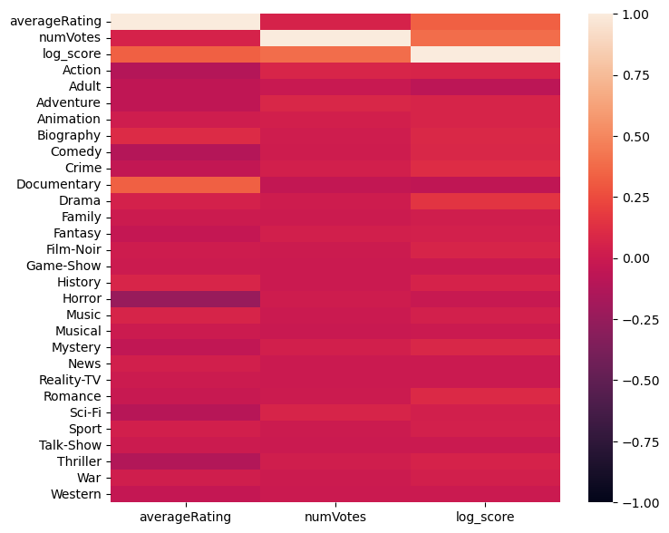

<!-- Sumárne štatistiky pre koreláciu žánru od skóre.
|       |   log_score |
|:------|------------:|
| count |  27         |
| mean  |   0.0394699 |
| std   |   0.0512069 |
| min   |  -0.0727358 |
| 25%   |  -0.002215  |
| 50%   |   0.0432643 |
| 75%   |   0.0682588 |
| max   |   0.155022  | -->

Pre skupiny žánrov korelácia neprináša lepšie výsledky. Skupiny žánrov - film má viac žánrov naraz. Takéto filmy majú koreláciu so skóre so strednou hodnotou približne nula a štandardnou odchýlkou 4%. Najlepšia skupina žánrov je trojica Comedy-Drama-Romance na 10%.

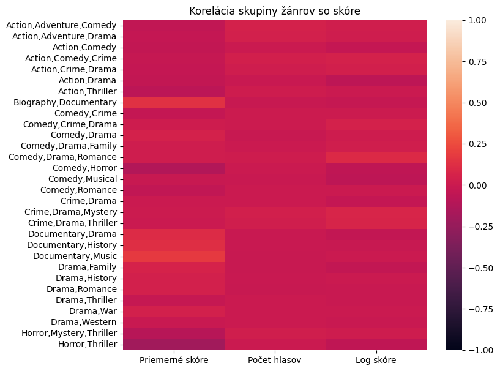

<!-- Závislosť skóre od viacerích žánrov
|       |    log_score |
|:------|-------------:|
| count | 30           |
| mean  | -0.000845098 |
| std   |  0.041377    |
| min   | -0.0656707   |
| 25%   | -0.030552    |
| 50%   | -0.00704689  |
| 75%   |  0.0228701   |
| max   |  0.099292    | -->

Dĺžka filmu ani rok výroby filmu nemajú zásadný vpliv na naše log skóre, obe majú koreláciu okolo 5%. 

## Hypotézy a pozorovania
Následne sme v našom projekte stanovili viacero hypotéz.

Našli sme stránku ranker.com, kde sú vytvorené rôzne rebríčky a ľudia tam hlasujú o poradí. Existuje tam aj rebríček najlepších a najhorších režisérov a chceli sme sa pozrieť na to,
či top režiséri skutočne robia lepšie filmy ako tí najhorší. Testovali sme teda následovnú hypotézu:
### Stredná hodnota priemerného log skóre filmov režírovaných najlepšími režisérmi(x) je menšia rovná ako stredná hodnota priemerného log skóre filmov režírovaných najhoršími režisérmi(y)
*H0: &mu;x <= &mu;y vs. H1: &mu;x > &mu;y*

Predtým ako budeme testovať musíme overiť či dáta x a y pochádzajú z normálneho rozdelenia.
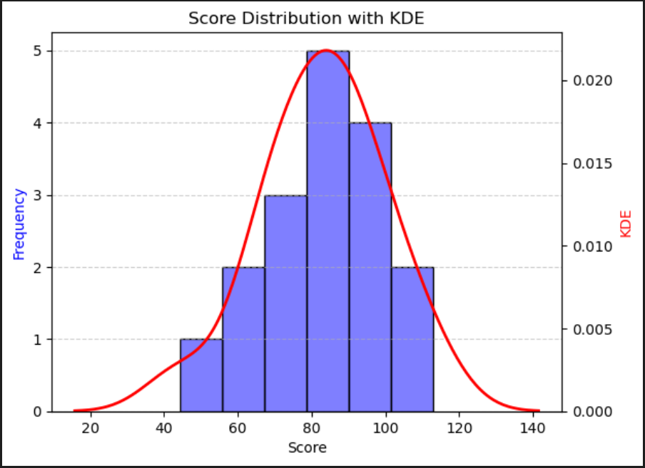 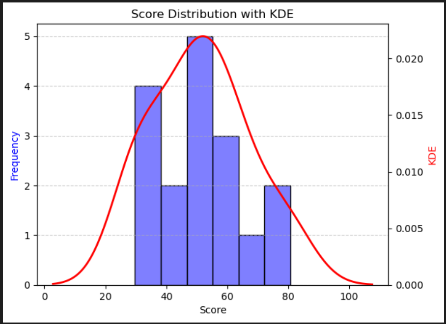
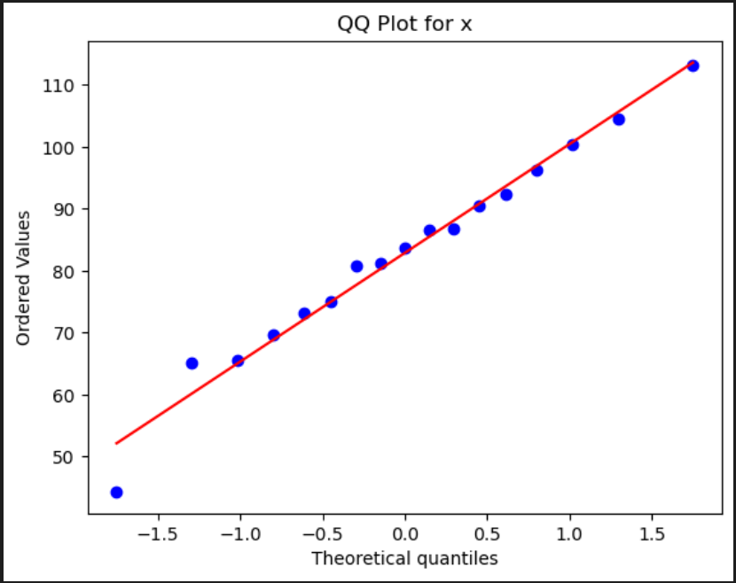 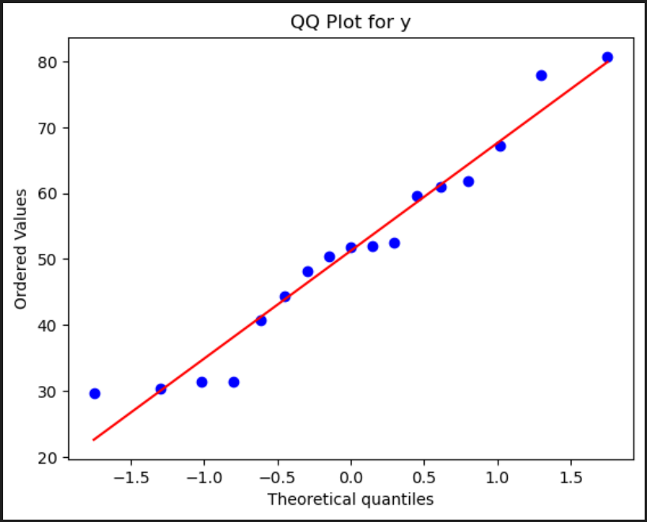

Skupiny dát x, y pochádzajú z normálneho rozdelenia, takže môžeme použiť študentov t-test. Ten nám vyšiel s p-hodnotou blízkou nule, a teda potvrdil alternatívnu hypotézu, že filmy obľúbených režisérov majú lepšie log skóre a sú teda obľôbenejšie. Tvrdíme teda, že ak film režíroval jeden z top 20 režisérov z rebríčka na ranker.com, tak má predpoklad na to byť
obľúbenejší ako keby ho režíroval režisér z opačného konca rebríčka.


Medzi počtom prekladov a log skóre bola oproti ostatným atribútom pomerne významná korelácia. Chceli sme preto otestovať či filmy s málo prekladmi majú naozaj horšie log skóre ako filmy s
veľkým počtom prekladov. Vychádzali sme z následovne postavenej hypotézy:
### Filmy s málo prekladmi majú lepšie alebo rovné skóre ako filmy s veľa prekladmi
*H0: &mu;x >= &mu;y vs. H1: &mu;x < &mu;y*

Filmy sme rozdelili podľa mediánu počtu prekladov(3) na 2 skupiny (x, y=filmy s viac prekladmi). Pred testovaním hypotézy sme najskôr museli overiť normalitu dát. Z následujúcich qq-plotov môžme vidieť, že ani jedna zo skupín sa neriadi normálnym rozdelením, čo potvrdil aj Kolmogorovov-Smirnovov test.

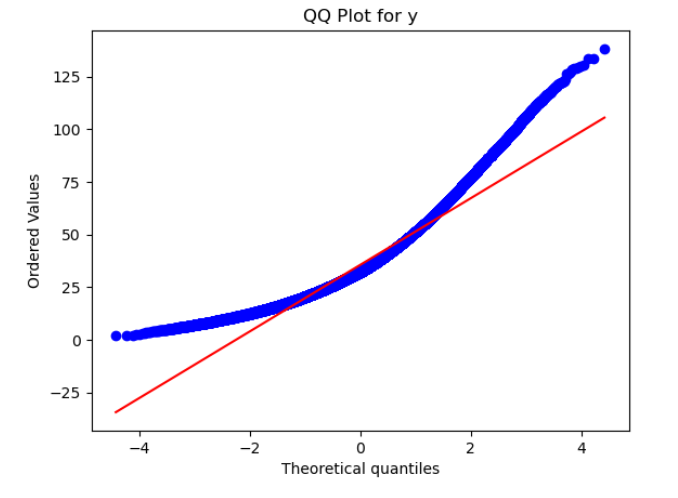 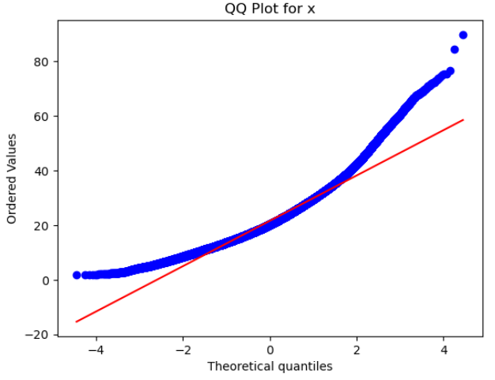

Následne sme na testovanie hypotézy Wilcoxonov rank test / Mann-Whitney U-test, ktorý prijal alternatívnu hypotézu. To znamená, že filmy čo majú viac prekladov majú tendenciu byť obľúbenejšie.


### Prítomnosť obľúbeného herca zvyšuje skóre filmu

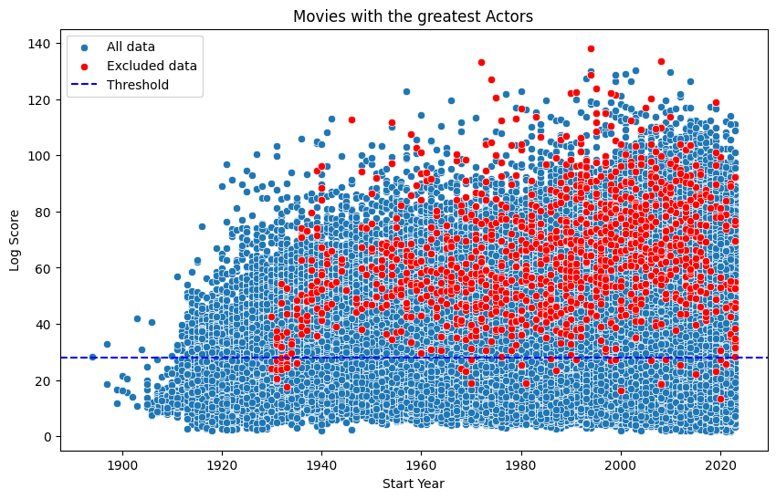

Prítomnosť obľúbeného herca mala vplyv na skóre na úrovni 0.5% 

### Filmy, kde hlavná postava mala znevýhodnenie, zvyšuje skóre filmu

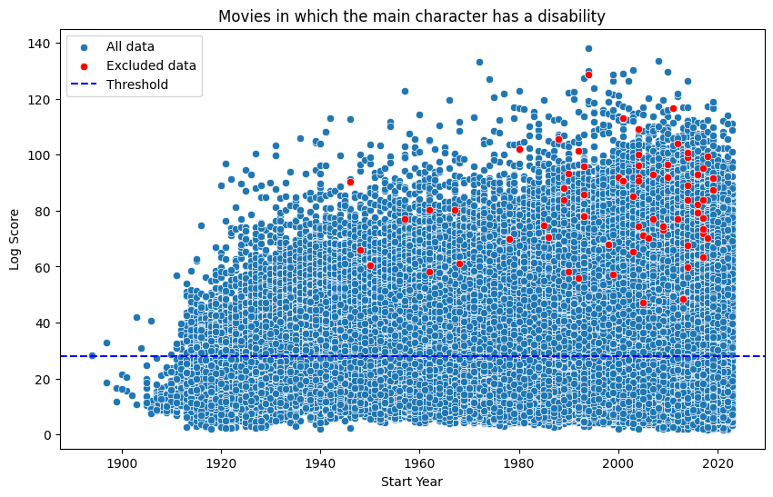

Tieto filmy mali vplyv na skóre na úrovni 0.5&permil;

### Filmy pre dospelích nezvyšujú skóre filmu


Filmy pre dospelích mali skóre 
