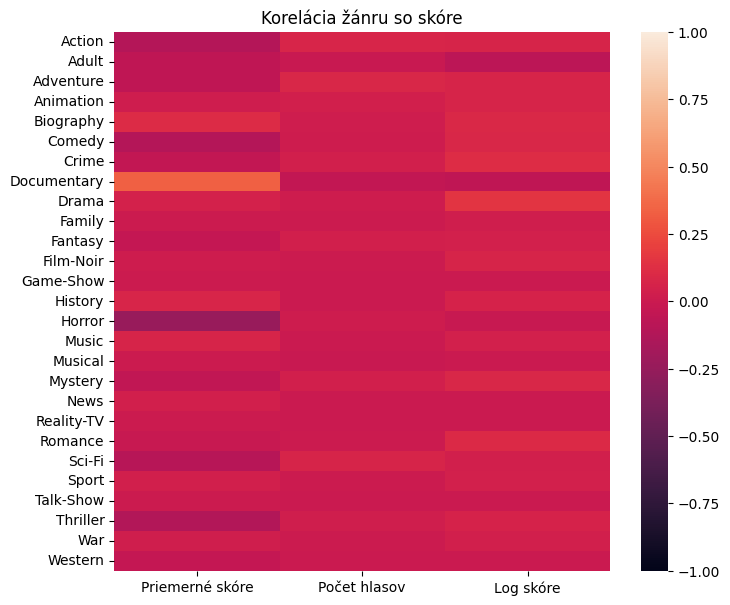
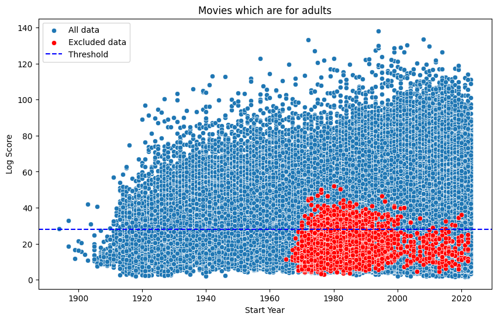

# Čo robí filmy obľúbenými/neobľúbenými
```
Projekt z predmetu Princípy dátovej vedy
Skupina: Lil Data
Členovia: Roderik Antol, Tomáš Belák, Adam Lopaška, František Václav Man
```

## Zdroj dát
Naše dáta pochádzajú z portálu IMDb - internetovej filmovej databázy. Stiahli sme si dáta vo formáte .tsv zo [stránky](https://datasets.imdbws.com/) a exportovali do databázy.

V práci používame primárne nami vytvorenú tabuľku `df_films`, ktorá vznikla spojením a dopočítaním viacerích tabuliek z našej databázy. V tabuľke máme nasledovné dáta o filmoch: 
- priemerné hodnotenie, 
- počet hodnotení, 
- nami vypočítané skóre (viac v nasledujúcej časti textu),
- počet prekladov filmu, 
- či je film pre dospelých, 
- rok výroby filmu, 
- dĺžka filmu v minútach, 
- žáner (jeden alebo viac) a 
- vek filmu - vypočítaný ako rok 2024 - rok výroby filmu.

Použité filtre na dáta:
- keďže chceme pracovať s filmami, odfiltrovali a vylúčili sme seriály, krátke filmy, videá a iné typy záznamov
- vybrali sme len hercov a režisérov a iba takích, ktorí pracovali na filmoch v našej tabuľke

Zároveň sme vyhľadali a pracovali aj s nasledujúcimi dátami
- 20 najlepších a 20 najhorších režisérov sme prebrali zo stránky ranker.com
- 20 najlepších hercov sme prevzali zo zoznamu od používateľa imdb.com s názvom <em>ChrisWalczyk55</em>
- Zoznam filmov, v ktorých aspoň jedna z hlavných postáv mala nejaké znevýhodnenie (fyzické či psychické), sme vygenerovali pomocou GPT-4

## Miera obľúbenosti
Pre definíciu miery obľúbenosti sme skúšali tri metriky. Prvou, a najlepšou bolo logskóre, vypočítané ako priemerné skóre filmu prenásobené logaritmom počtu hodnotení. 

Druhé skóre, ktoré sme skúšali, bolo normalizované skóre. Počítané ako priemerné skóre krát počet hodnotení filmu vydelené maximálnym skóre a maximálnym počtom hodnotení.

Ako tretie sme použili pragmatické skóre, počítané rovnako ako normalizované, iba namiesto maxím použijeme priemery. 

Z nasledujúcej tabuľky môžeme vidieť, že aj normalizované aj pragmatické skóre majú výraznejšie rozdiely medzi tretím a štrvtým kvartilom ako má log skóre. Log skóre bolo výhodnejšie aj z hľadiska matematických operácií a čitateľnosti, kde normalizované aj pragmatické skóre majú veľmi dlhé desatinné čísla. 

|       |   averageRating |         numVotes |    log_score |       norm_score |       prag_score |
|:------|----------------:|-----------------:|-------------:|-----------------:|-----------------:|
| count |    301868       | 301868           | 301868       | 301868           | 301868           |
| mean  |         6.17553 |   3627.84        |     28.0239  |      0.000898479 |      1.13691     |
| std   |         1.37358 |  35841           |     14.5419  |      0.0100013   |     12.6554      |
| min   |         1       |      5           |      1.79176 |      2.11646e-07 |      0.000267811 |
| 25%   |         5.3     |     19           |     17.8913  |      4.13768e-06 |      0.00523571  |
| 50%   |         6.3     |     61           |     24.6097  |      1.31432e-05 |      0.0166311   |
| 75%   |         7.1     |    315           |     34.1694  |      6.21367e-05 |      0.0786261   |
| max   |        10       |      2.83492e+06 |    138.175   |      0.93        |   1176.8         |

**TODO Prečo sme zvolili log skóre?**


Naša miera obľúbenosti, log skóre, má jednu zásadnú nevýhodu. Vieme ukázať, že film s veľmi veľa negatívnymi hlasmi môže mať rovnaké, ak nie lepšie log skóre, ako film s málo perfektnými hodnoteniami. Napríklad film s priemerným hodnotením 10 a desiatimi hlasmi bude mať rovnaké skóre, ako film s priemerným skóre 1 a počtom hlasov `10^10`. 

**TODO pohladat zaznamy, kde toto nastava a popisat, co s tym**

## Exploratívna dátová analýza
### Základné vlastnosti našich dát:

**TODO Rozdelenie log skóre**


Ako prvé sme pozreli, či a ako vplýva žáner filmu na jeho obľúbenosť. Z nasledujúcich grafov vidno, že skóre, resp. obľúbenosť, nemá významnú závislosť od žánru a skupín žánrov. Stredná hodnota korelácie je 4.3%, s tretím kvartilom na 6.8% percentách, čo je pod hranicou významnosti. Dva žánre, ktoré mali koreláciu nad 10%: Drama a Crime.

**TODO: Doplniť popis a vysvetlenia**



<!-- Sumárne štatistiky pre koreláciu žánru od skóre.
|       |   log_score |
|:------|------------:|
| count |  27         |
| mean  |   0.0394699 |
| std   |   0.0512069 |
| min   |  -0.0727358 |
| 25%   |  -0.002215  |
| 50%   |   0.0432643 |
| 75%   |   0.0682588 |
| max   |   0.155022  | -->

Pre skupiny žánrov korelácia neprináša lepšie výsledky. Skupiny žánrov - film má viac žánrov naraz. Takéto filmy majú koreláciu so skóre so strednou hodnotou približne nula a štandardnou odchýlkou 4%. Najlepšia skupina žánrov je trojica Comedy-Drama-Romance na 10%.


<!-- Závislosť skóre od viacerích žánrov
|       |    log_score |
|:------|-------------:|
| count | 30           |
| mean  | -0.000845098 |
| std   |  0.041377    |
| min   | -0.0656707   |
| 25%   | -0.030552    |
| 50%   | -0.00704689  |
| 75%   |  0.0228701   |
| max   |  0.099292    | -->

Dĺžka filmu ani rok výroby filmu nemajú zásadný vpliv na naše log skóre, obe majú koreláciu okolo 5%. 

## Hypotézy a pozorovania
Následne sme v našom projekte stanovili viacero hypotéz.

### Stredná hodnota priemerného skóre najlepších režisérov je menšia rovná ako stredná hodnota priemerného skóre najhorších režisérov
*H0: &mu;x <= &mu;y vs. H1: &mu;x > &mu;y*

Skupiny dát x, y pochádzajú z normálneho rozdelenia, takže môžeme použiť študentov t-test. Ten nám vyšiel s p-hodnotou blízkou nule, a teda potvrdil alternatívnu hypotézu, že filmy obľúbených režisérov majú lepšie skóre a sú teda obľôbenejšie.

### Filmy s málo prekladmi majú lepšie alebo rovné skóre ako filmy s veľa prekladmi

*H0: &mu;x >= &mu;y vs. H1: &mu;x < &mu;y*

### Prítomnosť obľúbeného herca zvyšuje skóre filmu


Prítomnosť obľúbeného herca mala vplyv na skóre na úrovni 0.5% 

### Filmy, kde hlavná postava mala znevýhodnenie, zvyšuje skóre filmu


Tieto filmy mali vplyv na skóre na úrovni 0.5&permil;

### Filmy pre dospelích nezvyšujú skóre filmu



Filmy pre dospelích mali skóre 
